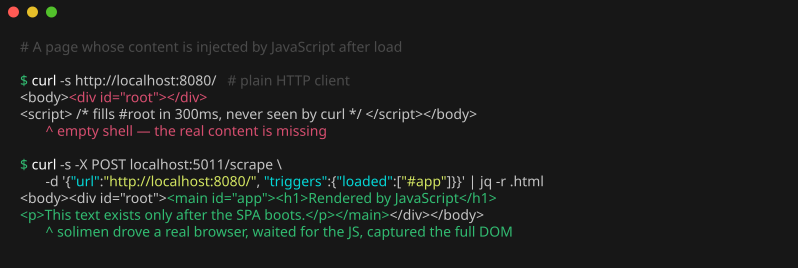
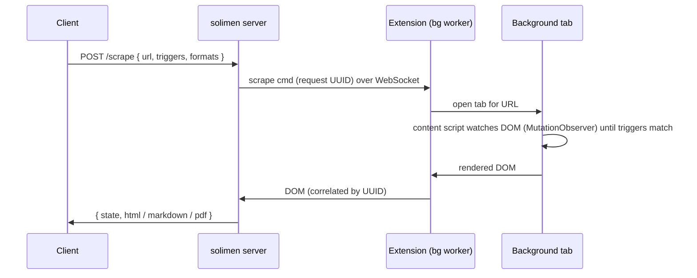

# solimen



A Chromium-backed DOM scraping service. `solimen` renders a page in a real
Chromium browser, waits for caller-defined CSS selectors to appear, and returns
the fully-rendered DOM as HTML, Markdown, or PDF over a small HTTP API.

Because it drives an actual browser rather than fetching raw HTML, it captures
content produced by JavaScript and single-page apps that a plain HTTP client
would miss.

Running a genuine Chromium browser means many "checking your browser"
interstitials and JavaScript challenges (e.g. Cloudflare-style checks) resolve on
their own before the DOM is exported. Note that `solimen` is not a CAPTCHA solver: pages that require human interaction or active
anti-automation measures may still block it.

## How it works

`solimen` launches a persistent Chromium process loaded with a small embedded
Manifest V3 extension and holds a WebSocket to the extension's background worker.
Each scrape flows through that browser:

1. A `POST /scrape` request arrives with a URL and optional CSS-selector triggers.
2. The server sends a scrape command (with a per-request UUID) over the WebSocket.
3. The extension opens a background tab for the URL.
4. The injected content script watches the page with a `MutationObserver` until
   the configured selectors match (or none were given, in which case it exports
   immediately).
5. The rendered DOM is posted back to the server, correlated by request ID, and
   returned in the requested formats.



Running `--instances N` starts N independent Chromium instances and dispatches
requests round-robin. Concurrent requests for the same URL are de-duplicated so
only one tab is opened and all callers share the result.

Each instance keeps its browser profile at `$XDG_CACHE_HOME/solimen/instance-N`
(`~/.cache/solimen/instance-N` by default) and reuses it across restarts, so
cookies and sessions persist and disk usage stays bounded by `--instances`. Set
`XDG_CACHE_HOME` to run two deployments side by side on one host.

## Requirements

- **Go 1.25+** to build from source.
- **Chromium** available on `PATH` as `chromium` to run the binary directly.
- **wkhtmltopdf** on `PATH`, only if you use the `pdf` output format. It is
  already included in the Docker image; the pure-Go `pdf-simplified` format needs
  no external binary.

Alternatively, use the Docker image, which bundles Chromium, wkhtmltopdf, and a
virtual display.

## Quickstart

With Docker:

```bash
docker compose -f docker/docker-compose.yml up --build
```

Then scrape a page:

```bash
curl -s -X POST http://127.0.0.1:5011/scrape \
  -H 'Content-Type: application/json' \
  -d '{"url": "https://example.com"}'
```

The response contains the rendered HTML:

```json
{ "state": "loaded", "html": "<!DOCTYPE html><html>…</html>" }
```

## Build

```bash
make build            # builds ./solimen
# or
go build ./cmd/solimen
```

`solimen --version` reports the build version.

Build the Docker image for local development:

```bash
docker compose -f docker/docker-compose.yml build
```

To build the release artifacts (cross-platform binaries and the release image)
locally without publishing, use GoReleaser:

```bash
make snapshot         # goreleaser release --snapshot --clean
```

## Usage

Run the binary (requires `chromium` on `PATH`):

```bash
./solimen --port 5011 --instances 1
```

### Configuration

Every flag can also be set via a `SOLIMEN_`-prefixed environment variable.

| Flag | Env var | Default | Description |
|------|---------|---------|-------------|
| `-H`, `--host` | `SOLIMEN_HOST` | `0.0.0.0` | HTTP listen host |
| `-p`, `--port` | `SOLIMEN_PORT` | `5011` | HTTP listen port |
| `-n`, `--instances` | `SOLIMEN_INSTANCES` | `1` | Number of parallel Chromium instances |
| `--ext-dir` | `SOLIMEN_EXT_DIR` | _(embedded)_ | Path to a Chromium extension directory, overriding the embedded one |
| `--use-sandbox` | `SOLIMEN_USE_SANDBOX` | `false` | Enable the Chromium sandbox (off by default; most container environments require it off) |

#### Instances

`--instances` controls how many independent Chromium processes are launched.
Requests are dispatched across them round-robin. A single instance can already
handle several scrapes at once (one background tab per request), so one is enough
for light or sequential use. Raising the count helps when you expect many
concurrent requests: it spreads the load across separate browsers, so a slow or
heavy page doesn't hold up others. Each instance is a full browser, so the memory
cost scales with the count. When running several in the container, raise the
compose `mem_limit` (2 GB by default) accordingly.

## API

### `POST /scrape`

Request body:

| Field | Type | Description |
|-------|------|-------------|
| `url` | string | **Required.** Page to scrape. |
| `triggers` | object | Optional CSS-selector triggers (see below). |
| `formats` | string[] | Output formats to return. Defaults to `["html"]`. |

**Triggers** decide when the page is considered ready. Each list holds CSS
selectors, and a state fires only when **every** selector in the list matches at
least one element:

```json
{
  "loaded": ["#main-content", ".results"],
  "failed": [".error-page"]
}
```

- `loaded` selectors that indicate a successful render.
- `failed` selectors that indicate the page failed to load.

If `loaded` is empty, the DOM is exported as soon as the page finishes loading.
Scraping times out after 30 seconds if no trigger matches.

**Formats** — any combination of:

| Format | Description |
|--------|-------------|
| `html` | The raw rendered DOM. |
| `markdown` | HTML converted to Markdown, with relative links resolved against the page URL. |
| `pdf` | HTML rendered to PDF with wkhtmltopdf, preserving layout and styling. Requires the `wkhtmltopdf` binary. |
| `pdf-simplified` | HTML converted to Markdown, then to a clean, de-styled PDF document. |

Response:

| Field | Type | Description |
|-------|------|-------------|
| `state` | string | `"loaded"` or `"failed"`, from the matched trigger. |
| `html` | string | Present when `html` was requested. |
| `markdown` | string | Present when `markdown` was requested. |
| `pdf` | string | Base64-encoded PDF bytes, present when `pdf` was requested. |
| `pdf_simplified` | string | Base64-encoded PDF bytes, present when `pdf-simplified` was requested. |

### `GET /health`

Returns `200` with `{"status":"ok","connected":true}` when at least one Chromium
instance has an active extension connection, or `503` with `"status":"degraded"`
otherwise.

## Examples

Plain HTML scrape:

```bash
curl -s -X POST http://127.0.0.1:5011/scrape \
  -H 'Content-Type: application/json' \
  -d '{"url": "https://example.com"}'
```

Wait for a single-page app to render specific elements:

```bash
curl -s -X POST http://127.0.0.1:5011/scrape \
  -H 'Content-Type: application/json' \
  -d '{
        "url": "https://app.example.com/dashboard",
        "triggers": { "loaded": ["#dashboard", ".widget"] }
      }'
```

Request Markdown instead of HTML:

```bash
curl -s -X POST http://127.0.0.1:5011/scrape \
  -H 'Content-Type: application/json' \
  -d '{"url": "https://example.com", "formats": ["markdown"]}'
```

## Docker

The image runs the binary under `supervisord` alongside an `Xvfb` virtual
display, since Chromium needs an X server even when headless. Configuration is
passed through the same `SOLIMEN_*` environment variables:

```bash
SOLIMEN_INSTANCES=2 docker compose -f docker/docker-compose.yml up --build
```

The compose file drops all Linux capabilities and disables the Chromium sandbox
(`SOLIMEN_USE_SANDBOX=false`), which is the supported configuration for most
container runtimes.

Two separate variables control the two addresses involved. `SOLIMEN_BIND_ADDR`
(compose only, default `127.0.0.1`) is the address on the host the port is
published on; `SOLIMEN_HOST` (default `0.0.0.0`) is the address solimen listens
on inside the container and should be left alone.

> **The API is unauthenticated.** `/scrape` fetches any URL a caller supplies, so
> a publicly reachable instance is an open proxy into whatever network it can
> reach. Keep `SOLIMEN_BIND_ADDR` on a loopback or private address and put an
> authenticating reverse proxy in front of it if it needs to be reachable.

A commented-out seccomp profile (`docker/seccomp/chrome.json`) is also included.
The intent was to keep the Chromium sandbox enabled while still running the
container as an unprivileged user, since the sandbox otherwise needs elevated
privileges. That profile is not currently working and is not maintained; it is
left in place only as a starting point for anyone who wants to pursue that setup.
It is currently not a supported feature.

A production compose file using the published `ghcr.io/ma111e/solimen` image is in
[docker/prod/docker-compose.prod.yml](docker/prod/docker-compose.prod.yml). It
pulls rather than builds, and `SOLIMEN_VERSION` selects the tag (defaulting to
`latest`); pin it to a released version for production:

```bash
SOLIMEN_VERSION=v1.0 docker compose -f docker/prod/docker-compose.prod.yml up -d
```

## Releases

Releases are tag-driven. Pushing a `vX.Y.Z` tag runs the GitHub Actions release
workflow ([.github/workflows/release.yml](.github/workflows/release.yml)), which
uses [GoReleaser](https://goreleaser.com) to:

- build the cross-platform binaries (Linux, macOS, Windows; amd64 and arm64) and
  attach them, with checksums and a generated changelog, to a GitHub Release;
- build and push the Docker image to `ghcr.io/ma111e/solimen`, tagged with the
  version, the `vX.Y` minor line, and `latest`.

```bash
git tag v1.0.7
git push origin v1.0.7
```

## Project layout

```
cmd/solimen/
  main.go            CLI entry point, browser lifecycle, extension extraction
  internal/api/      HTTP server (/scrape, /health)
  internal/converter/ HTML → Markdown / PDF conversion
  extension/         embedded Manifest V3 extension (background + content scripts)
pkg/chromium/        Chromium scraper and round-robin pool
pkg/models/          shared types (trigger definitions)
docker/              Dockerfiles (dev + release), compose files, supervisor config
.github/workflows/   release pipeline
.goreleaser.yaml     build, archive, and image release configuration
```

## License

Licensed under the MIT License — see [LICENSE](LICENSE).
